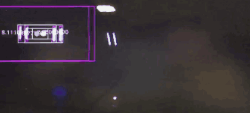
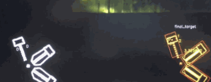
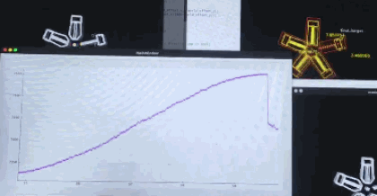
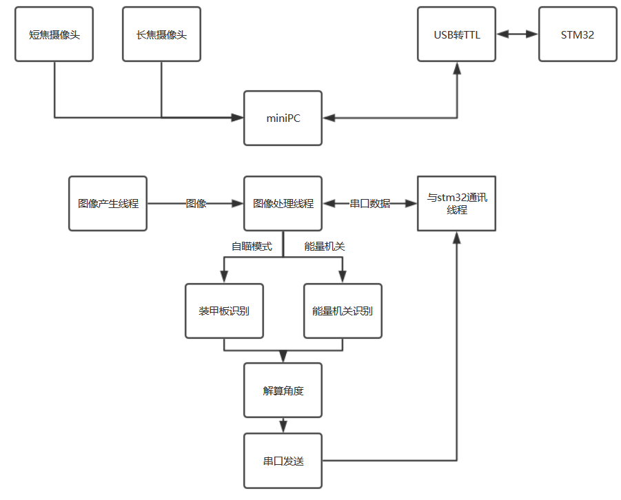
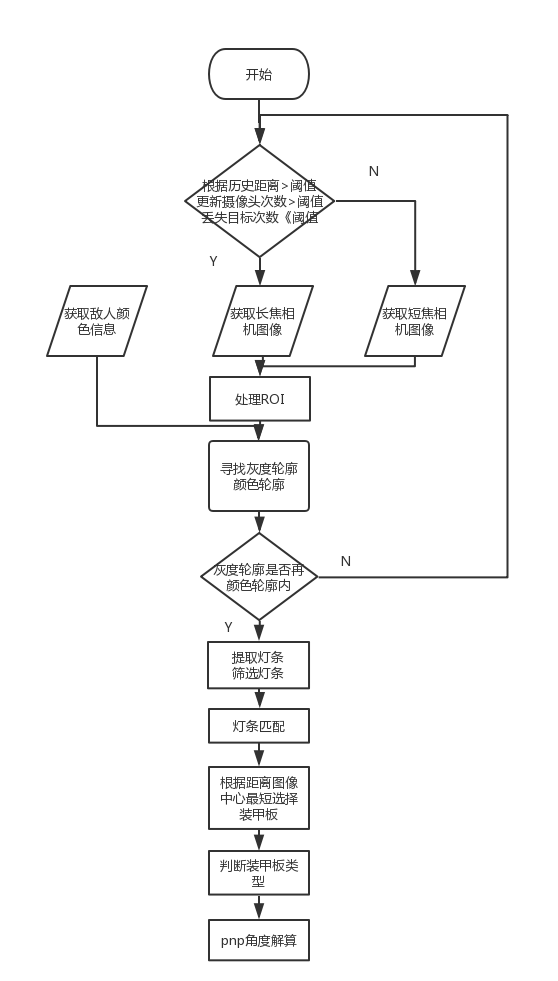
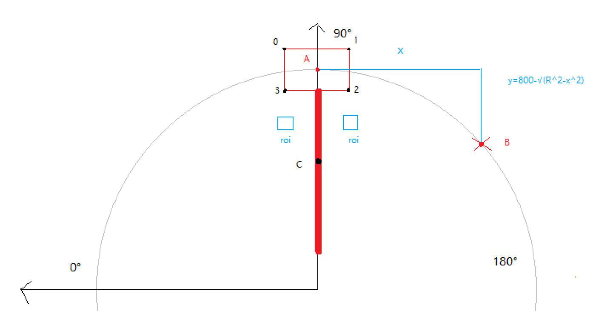
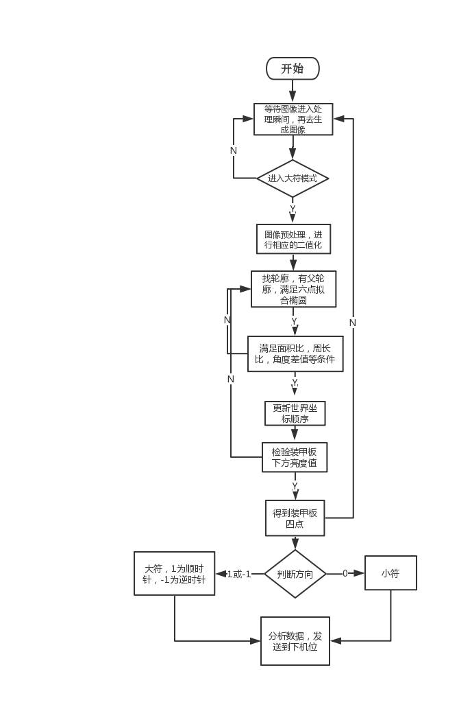

----------
# Robomaster2019全国赛北理珠毅恒团队步兵视觉

----------
#### 最新调试修订2020.2.4
在调试过程中终端出现很多空的方括号，这是相机内外参矩阵没有读入，可自行修改绝对路径或者若使用QT默认的当前项目目录下创建编译目录，则将`base.h`中将`#define CAMERA0_FILEPATH `和`#define CAMERA1_FILEPATH `内容中`rm-vision`改成`rm_vision`可引导到该项目相机参数文件夹中。
qq群号：976973704
## 目录

* [1.功能介绍](#1功能介绍)

* [2.效果展示](#2效果展示)

* [3.依赖工具与软硬件环境](#3依赖工具与软硬件环境)

* [4.编译与安装方式](#4编译与安装方式)

* [5.文件目录结构及文件用途说明](#5文件目录结构及文件用途说明)

* [6.软件与硬件的系统框图与数据流图](#6软件与硬件的系统框图与数据流图)

* [7.原理介绍与理论支持分析](#7原理介绍与理论支持分析)

* [8.软件架构](#8软件架构)

* [9.未来优化的方向](#9未来优化的方向)

* [10.配置教程及交流](#10配置教程及交流)

 ## 1.功能介绍
 ----------
·本开源项目中Robomaster2019装甲板视觉识别和能量机关视觉识别。

·自定义串口通讯协议与stm32进行通讯控制云台运动。

·自动击打能量机关的控制逻辑。

·基于Qcustomplot编写的绘制波形的上位机，可实时上传数据并显示


 ## 2.效果展示
 ----------
### 装甲板识别
普通相机选用了4mm焦距640x360分辨率，可识别0m至2m装甲板，工业相机选用6mm焦距640x480分辨率，可识别1m至7m装甲板。装甲板识别预处理采用ICRA的颜色包围灰度灯条的思想，利用选择最小强度的方式，大大降低了低分辨率内八误识别问题。整体算法识别采用多线程，跑一帧图像1ms，加入roi可降至0.3ms满足实时性。




### 能量机关识别
能量机关采用传统方法，处理单帧图像在1.5ms左右



### 上位机绘制波形



## 3.依赖工具与软硬件环境
 ----------
### 软件运行环境：

•	ubuntu 16.04

•	OpenCV 3.4.6

•	Qt Creator 5.12

•	CMake 3.5.1

•	GCC 5.4.0

硬件

·免驱摄像头

·USB转TTL串口

## 4.编译与安装方式
----------
使用qtcreator打开rm-vision.pro编译运行

## 5.文件目录结构及文件用途说明
----------

``` 
YIHENG_ZHBIT_VISION\
│  base.h						基础集成功能头文件，便于修改宏定义
│  license.txt
│  mainwindow.cpp					绘制波形窗口
│  mainwindow.h		
│  mainwindow.ui					上位机ui界面
│  qcustomplot.cpp					绘图开源库
│  qcustomplot.h
│  README.md
│  rm-vision.pro				
│  
├─armor_detection					装甲板识别
│      armor_detect.cpp
│      armor_detect.h
│      
├─buff_detection					能量机关识别
│      buff_detect.cpp
│      buff_detect.h
│      buff_offset.xml
│      
├─camera						相机类
│  │  camera_device.cpp					相机驱动
│  │  camera_device.h
│  │  save_video.cpp					保存录像
│  │  save_video.h
│  │  
│  └─camera_param					相机标定文件
│          camera4mm.xmll;
│          camera8mm.xml
│          galaxy_0.xml
│          
└─common						常用文件夹
    │  main.cpp						开启线程	
    │  thread_control.cpp				各线程控制
    │  thread_control.h
    │  
    ├─filter						滤波器（kalman、二项式）
    │      predict.cpp				
    │      predict.h
    │      
    ├─serial						串口通讯
    │      serial_port.cpp
    │      serial_port.h
    │      
    └─solve_angle					角度解算
            solve_angle.cpp
            solve_angle.h
            
```

## 6.软件与硬件的系统框图与数据流图
----------



### 串口通讯协议

接受下位机数据

| 头帧 | 数据1 | 数据2 | 数据3   | 数据4     | 尾帧 |
| ---- | ----- | ----- | ------- | --------- | ---- |
| 0xaa | 模式  | 颜色  | yaw补偿 | pitch补偿 |  0xbb |

``` 
数据1 模式 0为自瞄模式 1为能量机关模式
数据2 颜色 自身颜色 0为蓝色 1为红色
数据3 yaw补偿 能量机关yaw补偿 -128 ~ 127
数据4 pitch补偿 能量机关pitch补偿 -128 ~ 127
```

发送至下位机数据

| 头帧 | 数据1         | 数据2         | 数据3           | 数据4           | 数据5 | 尾帧 |
| ---- | ------------- | ------------- | --------------- | --------------- | ----- | ---- |
| 0xaa | yaw角度低八位 | yaw角度高八位 | pitch角度低八位 | pitch角度高八位 | 命令  | 0xbb |
``` 
数据1|2 yaw角度
数据3|4 pitch角度
数据5 按位进行操作 自瞄模式：0未发现敌人 1发现敌人
				能量机关模式：0没找到目标 1跟随 3和1交替发射子弹 5复位
```


## 7.原理介绍与理论支持分析
----------

### 自瞄

	
####基本原理
由于采用地分辨率高帧率的摄像头，因此在装甲板识别的过程中存在看的了远的看不了近的，看得了近的看不了远的情况，为此选择了长短焦距的两款相机做自瞄，长焦摄像头既可以远距离自瞄同时也可以击打能量机关。

a.首先判断需要什么焦距的图像进行输入，最主要根据距离进行判断，利用官方开源的思想`dist_ = (1-r_)*dist_ + r_*distance_` 其中`r`为刷新频率，介于`0.0 - 1.0`之间 `distance_`上一个装甲板角度解算的距离，`dist`用于最终判断是否需要切换镜头。同时程序中加入`lost_cnt_ % 200 == 0 && lost_cnt_ != 0`丢失目标自动切换以防止漏检测的情况以及避免反复更换相机的情况。
	
b.若使能`#define ROI_ENABLE`宏定义则通过历史数据得到目标ROI矩形
	
c.同时对RGB颜色及灰度进行二值化，判断灰度灯条轮廓的其中一个点是否在RGB颜色光圈的轮廓内利用`pointPolygonTest`函数，将符合条件的灰度灯条构建`LED_Stick `类，将旋转矩形角度从`0 - 360`转换成`-180 - 180`。
	
d.灯条进行两两配对构造`armor`类，首先初步筛选符合尺寸大小的装甲板，两灯条高度相似，高度差不大，长宽比一定范围`is_suitable_size`。
	
e.利用计算装甲板两个灯条中间区域的平均强度`get_average_intensity`，用于筛选装甲板中间有灯条的情况。
	
f.进行灯条最优匹配`max_match`，定义了`float f = error_angle + 0.5 * angle_8;`其中`f`是匹配系数，越小越匹配，`angle_8`是内八角度，当两个灯条内八是`angle_8`的值是两个灯条的角度否则是`0`。每个`LED_Stick `灯条类中有三个成员参数分别是`matched`是否已经有匹配的灯条、`match_index`对象序号、`match_factor`上述的匹配系数。当遍历灯条计算匹配系数小于之前的匹配系数，代表有更优的匹配关系，以前的匹配灯条的关系将会解除，新的更优的匹配关系将会产生。最终遍历结束得到候选装甲板。
	
g.利用距离图像中心点最近的方式在候选装甲板中选择一个最终装甲板，对装甲板类型进行滤波判断提取装甲板的四个顶点放入pnp解算中解算。
	
### 能量机关



#### 能量机关预测
利用了pnp位姿估计的原理进行预测，不需要寻找能量机关的中心R，很简单粗暴的方式进行预测
我们通常将世界坐标系的3d点设置在装甲板的正中心，例如上图装甲板四个顶点坐标可以写为
``` 
点0 x:115 y:65 z:0
点1 x:-115 y:65 z:0
点2 x:-115 y:-65 z:0
点3 x:115 y:-65 z:0
```
这是打小能量机关时的做法，大能量机关移动靶则首先需要判断旋转方向，根据不同的旋转方向设置目标的世界坐标系下的点。以上图为例，能量机关顺时针旋转，此时识别到A点，预测距离x（x预测距离根据整体算法延迟、及云台响应来调整），预测距离y可根据能量机关半径800mm来定。最终要想击打预测点B（假设预测距离x设为350）可将当前世界坐标系的3d点设置为
```
点0 x:-235 y:-15.62 z:0
点1 x:-465 y:-15.62 z:0
点2 x:-465 y:-145.62 z:0
点3 x:235 y:-145.62 z:0
```
这样将预测目标点设置在了B点，但由于视觉处理等延迟，在实际云台运动中恰好能跟上目标，实现预测效果。




a.图像二值化的操作:在分区赛时使用的是BGR三通道的差值，在国赛采用灰度二值化。原因是国赛中神符蓝方的颜色明显比红方亮度暗，神符两边的颜色都要比神符颜色亮。二值化的方法很多，可以尝试更多不一样的方法。
	
b.找轮廓：`findContours`函数中`hierarchy`，定义为`vector<Vec4i>hirerarchy`，定义了一个”向量内每个元素保存了一个包含四个`int`整型变量“的向量，`hierarchy[i][0]~hierarchy[i][3]`，分别表示第i个轮廓的后一个轮廓，前一个轮廓，父轮廓，内嵌轮廓的索引编号。如果当前轮廓没有对应的后一个轮廓、前一个轮廓、父轮廓、内嵌轮廓的话，则`hierarchy[i][0]~hierarchy[i][3]`的相应位被设置为默认值-1。我们采用`CV_RETR_CCOMP`检测所有的轮廓，但所有轮廓只建立两个等级关系，外围为顶层，若外围内的内围轮廓还包含了其他的轮廓信息，则内围内的所有轮廓均归属于顶层。利用这个关系，可以发现，我们的目标是装甲板那个小轮廓，可以把没有父轮廓（`hierarchy[i][3]<0`）的跳过。由于建立起了父子轮廓的关系，我们可以根据他们的面积比，周长比进行第一次粗略的筛选。将找到的轮廓画旋转矩形，按父子轮廓放入`Object`类里面，父轮廓为`big_rect_`,子轮廓（待击打目标）为`small_rect_`；
```
 if(hierarchy[i][3]<0 || contours[i].size() < 6)
            continue;

 if(small_rect_area * 12 >big_rect_area && small_rect_area* area_ratio<big_rect_area  && small_rect_size_ratio > 1 && small_rect_size_ratio < 3.0f)
```
我们对小装甲板以及扇叶的矩形拟合采用的是椭圆拟合矩形fitEllipse。原因是椭圆拟合出来的角度更加准确。我们利用椭圆拟合矩形的角度，把筛选条件限定在装甲板和扇叶拟合出来的矩形的角度差值在80-110之间。

```
if(object.diff_angle<100 && object.diff_angle>80)
```

c.在这些筛选条件之后，确定旋转矩形的四点顺序，原理为，拟合椭圆出来的矩形是以短边水平线夹角为其角度的，其角度范围为0-180。根据这个原理，我们只要判断装甲板的两条长边的中心点跟`big_rect_`中心点的距离近，就可以顺利得到装甲板四点的正确的顺序。

d.判断旋转矩形类型，通过两旁的灯杆。利用装甲板两条宽边向圆心方向延一段比例的距离，建立两个小块roi区域，计算roi区域的平均值，若roi区域均有值，则表明目标矩形是激活的（装甲板旁边有两个杆）否则未激活。

e.判断顺时针还是逆时针的方法是根据历史角度和当前角度的差值（要滤波）来判断.先去掉较大和较小的插值，在同自瞄的滤波思路一样`d_angle_ = (1 - r) * d_angle_ + r * diff_angle_;`。

f.最后通过顺逆时针判断大小能量机关，更新世界坐标原点解pnp发送串口。


## 8.软件架构
----------
### 快速上手
程序为了方便多人合作开发整体采用模块化设计
`base.h`是总的调试宏定义头文件，内含资源岛测试快速宏定义、能量机关自动控制项、系统调试、线程使能、装甲板识别配置、能量机关识别信息、摄像头信息、外部驱动配置和一些比较常用的打印数据，计算时间的宏定义接口。
`command`文件夹中`main.cpp`负责线程的总开关，由`base.h`宏定义控制，线程的具体实现方法在`thread_control.cpp`源文件中。

`thread_control.cpp`源文件中声明响应模块的单例类例如`ArmorDetector armor_detector;`或`BuffDetector buff_detector;` 串口通讯产生的数据统一由`other_param`类传递。最终调用方式（装甲板识别为例）
```
command = armor_detector.ArmorDetectTask(image, other_param);
armor_detector.getAngle(angle_x, angle_y);
```
将串口命令及角度信息传递出来，发送至串口。
小组成员只需要在相应的模块内（例如`buff_detect.cpp`）实现相同的接口就可以只在对应模块的头文件和源文件开发，不需要繁琐操作其他文件的东西。

### 调试运行
调试程序只需要修改`base.h`即可

程序加入了笔记本离线调试选项，开启宏定义`#define DEBUG_VIDEO 1`其中宏定义的值0和1分别是两个视频的（自瞄视频，能量机关视频），视频路径修改在
```
#define ARMOR_VIDEO_PATH "../Videos/test.avi"
#define BUFF_VIDEO_PATH "../Videos/test.avi"
```
同时需要将下方结构体中`mode`改成对模式

``` 
struct OtherParam
{
    int color = 1;       // 我方车辆颜色，0是蓝色，1是红色。用于图像预处理
    int mode = 0;        // 视觉模式，0是自瞄模式，1是能量机关模式
    int cap_mode = 1;    // 摄像头类型，0是短焦摄像头，1是长焦摄像头
    float gimbal_data;
    float buff_offset_x;
    float buff_offset_y;
};
```
外部测试
外部设备统一更改宏定义
``` 
//****** 外部驱动配置 *****
#define SERIAL_PATH "/dev/stm32"
#define SERIAL_BAUD B115200     // B115200 B921600
#define GIMBAL_PATH "/dev/ttyUSB0"
#define GIMBAL_BAUD B921600
#define CAMERA0_PATH "/dev/camera"
#define CAMERA1_PATH "/dev/video1"
```
`/dev/camera`和`/dev/video1`查看自己电脑的`/dev/*`做修改
当需要接摄像头调试的时候需要将`#define SHORT_CAMERA_ENABLE 0`从0至1，不用时则关闭0。
同理双摄像头长焦相机也是上述方法`#define LONG_CAMERA_ENABLE  0`从0至1，不用时则关闭0
短焦长焦相机默认使用普通相机，若想使用工业相机只能长焦配置需要取消注释`#define GALAXY`

当需要接入串口时需要使能`#define GET_STM32_THREAD`

工业相机使用的是大恒，考虑程序的通用性，默认关闭了工业相机的编译，如若开启需要注释掉```#define CANCLE_GALAXY   // 取消工业相机宏定义```
同时取消注释掉rm-vision.pro中
```
#LIBS += -lgxiapi \
#-ldximageproc

#INCLUDEPATH += ../dhcam_install_20181107/dh_camera/daheng-sdk-x64/sdk/genicam/library/CPP/include
#INCLUDEPATH += ../dhcam_install_20181107/dh_camera/daheng-sdk-x64/sdk/include
```

开启录像线程使能宏定义`#define SAVE_VIDEO_THREAD`
显示调试使能`#define WAITKEY 1`以及`#define IMAGESHOW`

## 9.未来优化的方向
----------

1.阈值问题：场地光线的问题，是我们一直遇到的问题。在分区赛期间，原本的定阈值方法不可行，于是采用了CV_THRESH_OTSU。但是到了国赛，这个又不适用了，是通过比赛时录的视频进行定阈值。希望可以在自适应阈值方面可以有所改进，可以不用机械地定阈值。

2.能量机关自动击打问题。我们是在分区赛后视觉这边才开始尝试做自动，还有很多不足的地方，希望之后可以做到，掌握节奏，加快击打的速度。

3.能量机关在点亮第四个扇叶的同时，完全可以预测第五个待击打目标。但是由于为了比赛求稳定，而且在比赛过程中也遇到了很多图像处理的问题，所以没有尝试过预测的方案。所以希望有同学能实现这个未完成的任务。

4.自动瞄准没能很好的克制小陀螺的情况，希望明年对攻克小陀螺有重大的突破

## 10.配置教程及交流
加入tutorial.pdf文件，里面有自己总结工控机配置和工业相机驱动链接。

欢迎大家加群交流


